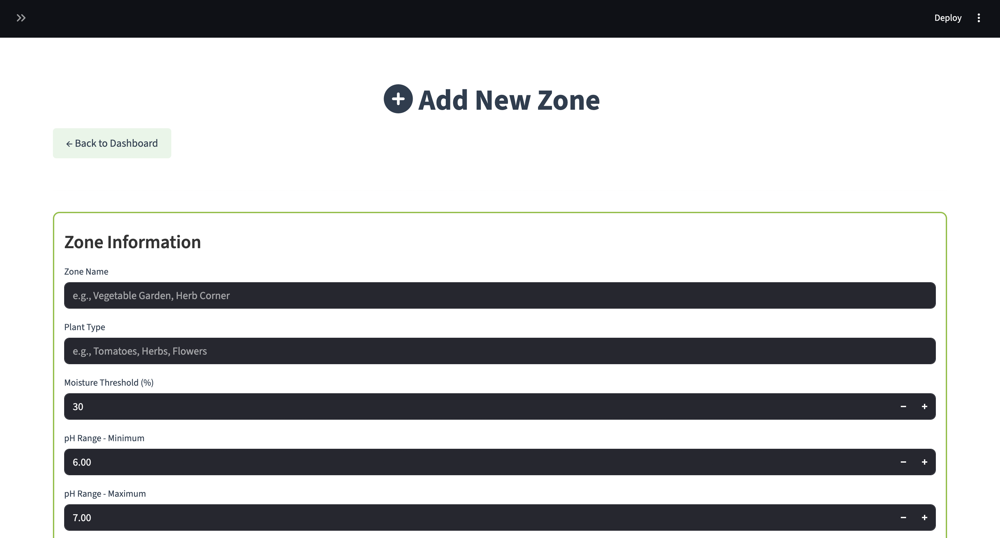

# Smart Gardening Dashboard

A comprehensive IoT-based smart gardening system with real-time monitoring, automated watering, and an intuitive web dashboard built with Streamlit.

## Table of Contents

- [Features](#features)
- [Screenshots](#screenshots)
- [Installation](#installation)
- [Usage](#usage)
- [Project Structure](#project-structure)
- [Database Schema](#database-schema)
- [API Endpoints](#api-endpoints)
- [Configuration](#configuration)
- [Contributing](#contributing)
- [License](#license)

## Features

### Core Functionality

- **Real-time Zone Monitoring** - Monitor multiple garden zones simultaneously
- **Automated Watering System** - Smart pump control based on moisture thresholds
- **pH Level Tracking** - Monitor soil pH levels for optimal plant growth
- **Plant Management** - Add, track, and remove individual plants within zones
- **Sensor Data Visualization** - Historical charts and analytics for sensor readings

### User Interface

- **Modern Dashboard** - Clean, responsive web interface built with Streamlit
- **Multi-page Navigation** - Seamless navigation between different sections
- **Real-time Updates** - Live sensor data and status updates
- **Interactive Charts** - Visual representation of moisture and pH trends
- **Professional Styling** - Consistent color scheme throughout

### Technical Features

- **Database Integration** - SQLite database with SQLAlchemy ORM
- **Simulated Sensors** - Realistic sensor data simulation for development
- **Automated Pump Control** - Intelligent watering based on moisture levels
- **Last Watered Tracking** - Automatic timestamp recording when pumps activate
- **Form Validation** - Input validation and error handling

## Screenshots

### Main Dashboard

- Garden zones overview with real-time status
- Moisture and pH level monitoring
- Pump status indicators
- Last watered timestamps


### Zone Management

- Add new garden zones with custom configurations
- Set moisture thresholds and pH ranges
- Configure plant types and growing conditions
  
  <br>
  

### Plant Management

- Add plants to specific zones
- Track planting dates and notes
  
  <br>
  
- View plants by zone
- Remove plants with confirmation dialog
- Maintain data integrity during plant removal


### Zone Details

- Detailed zone information and configuration
- Current sensor readings and status
- Historical data visualization
- Plant inventory within zones


## Installation

### Prerequisites

- Python 3.8 or higher
- pip package manager

### Setup Instructions

1. **Clone the repository**

   ```bash
   git clone <repository-url>
   cd iot-smart-gardening
   ```

2. **Create and activate virtual environment**

   ```bash
   python -m venv .venv
   source .venv/bin/activate  # On Windows: .venv\Scripts\activate
   ```

3. **Install dependencies**

   ```bash
   pip install -r requirements.txt
   ```

4. **Initialize the database**

   ```bash
   python smart_gardening/init_database.py
   ```

5. **Run the application**
   ```bash
   streamlit run smart_gardening/dashboard/app.py
   ```

## Usage

### Starting the Dashboard

1. Navigate to the project directory
2. Activate your virtual environment
3. Run `streamlit run smart_gardening/dashboard/app.py`
4. Open your browser to `http://localhost:8501`

### Adding a New Zone

1. Click "Add New Zone" on the main dashboard
2. Fill in zone details:
   - Zone name
   - Plant type
   - Moisture threshold (%)
   - pH range (min/max)
3. Click "Create Zone"

### Adding Plants to Zones

1. Click "Add Plant to Zone" on the main dashboard
2. Select the target zone
3. Enter plant details:
   - Plant name
   - Plant type
   - Planting date
   - Notes (optional)
4. Click "Add Plant"

### Removing Plants from Zones

1. Navigate to the zone details page
2. Locate the plant you want to remove
3. Click the red "❌" button next to the plant
4. Review the plant information on the confirmation page
5. Click "❌ Remove Plant" to confirm removal
6. The plant will be permanently removed from the database

### Viewing Zone Details

1. Click on any zone header on the main dashboard
2. View detailed information including:
   - Current sensor readings
   - Pump status
   - Last watered time
   - Plant inventory
   - Historical data charts

## Project Structure

```
iot-smart-gardening/
├── smart_gardening/
│   ├── dashboard/
│   │   ├── app.py                 # Main dashboard application
│   │   └── pages/
│   │       ├── add_zone.py        # Add zone page
│   │       ├── add_plant.py       # Add plant page
│   │       ├── zone_details.py    # Zone details page
│   │       └── remove_plant.py    # Remove plant confirmation page
│   ├── core/
│   │   └── zone.py               # Zone model and logic
│   ├── db/
│   │   ├── database.py           # Database models and setup
│   │   └── database.db           # SQLite database file
│   ├── sensors/
│   │   ├── moisture_sensor.py    # Moisture sensor simulation
│   │   └── ph_sensor.py          # pH sensor simulation
│   ├── actuators/
│   │   └── pump.py               # Water pump control
│   ├── simulator/
│   │   └── simulator.py          # Sensor data simulation
│   ├── config.py                 # Configuration settings
│   ├── main.py                   # Main application entry point
│   ├── init_database.py          # Database initialization script
│   └── update_database.py        # Database update script
├── requirements.txt              # Python dependencies
├── README.md                     # This file
└── LICENSE                       # License information
```

## Database Schema

### Zones Table

- `id` (Primary Key) - Auto-incrementing zone identifier
- `name` - Zone name/description
- `plant_type` - Type of plants in the zone
- `moisture_threshold` - Target moisture percentage
- `ph_min` - Minimum acceptable pH level
- `ph_max` - Maximum acceptable pH level
- `created_at` - Zone creation timestamp
- `last_watered` - Last watering timestamp

### Plants Table

- `id` (Primary Key) - Auto-incrementing plant identifier
- `zone_id` (Foreign Key) - Reference to zones table
- `name` - Plant name
- `plant_type` - Type/category of plant
- `planting_date` - Date when plant was added
- `notes` - Additional plant information
- `created_at` - Plant creation timestamp

### Database Functions

- `remove_plant(plant_id, db_session)` - Safely remove a plant with validation
- `get_plant_by_id(plant_id)` - Retrieve a plant by its ID with validation
- `get_zone_by_id(zone_id)` - Retrieve a zone by its ID with validation

### Sensor Readings Table

- `id` (Primary Key) - Auto-incrementing reading identifier
- `zone_id` (Foreign Key) - Reference to zones table
- `moisture` - Moisture level percentage
- `ph` - pH level reading
- `timestamp` - Reading timestamp

### Pump Logs Table

- `id` (Primary Key) - Auto-incrementing log identifier
- `zone_id` (Foreign Key) - Reference to zones table
- `status` - Pump status (ON/OFF)
- `timestamp` - Log timestamp

## Configuration

### Environment Variables

- `MOISTURE_THRESHOLD_DEFAULT` - Default moisture threshold (default: 30%)
- `PH_MIN_DEFAULT` - Default minimum pH (default: 6.0)
- `PH_MAX_DEFAULT` - Default maximum pH (default: 7.5)

### Color Scheme

- **Primary Green**: `#35B925` - Main brand color
- **Secondary Brown**: `#754D33` - Hover states and accents
- **Light Green**: `#D4fd0` - Background elements
- **Medium Green**: `#88c030` - Secondary elements
- **Text Color**: `#2c3e50` - Dark blue-gray for readability

## Development

### Adding New Features

1. Create feature branch: `git checkout -b ft/new-feature`
2. Implement changes following the existing code structure
3. Update database schema if needed
4. Test thoroughly
5. Submit pull request

### Database Migrations

- Use `init_database.py` for initial setup
- Use `update_database.py` for schema updates
- Always backup existing data before migrations

### Styling Guidelines

- Use the established color scheme
- Maintain consistent button styling
- Follow the existing CSS patterns
- Test on different screen sizes

### Testing

The project includes comprehensive test coverage:

- **Database Tests** - Plant removal, validation, and data integrity
- **UI Tests** - Remove plant workflow and navigation
- **Integration Tests** - End-to-end functionality testing
- **Unit Tests** - Individual component testing

Run tests with: `python tests/run_tests.py`

## Contributing

1. Fork the repository
2. Create a feature branch
3. Make your changes
4. Add tests if applicable
5. Update documentation
6. Submit a pull request

## License

This project is licensed under the MIT License - see the [LICENSE](LICENSE) file for details.

## Acknowledgments

- Streamlit for the amazing web framework
- SQLAlchemy for robust database management
- FontAwesome for beautiful icons
- The open-source community for inspiration and tools

---

**Built with love for smart gardening enthusiasts**
